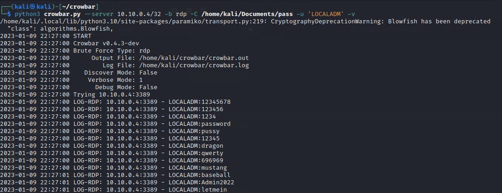
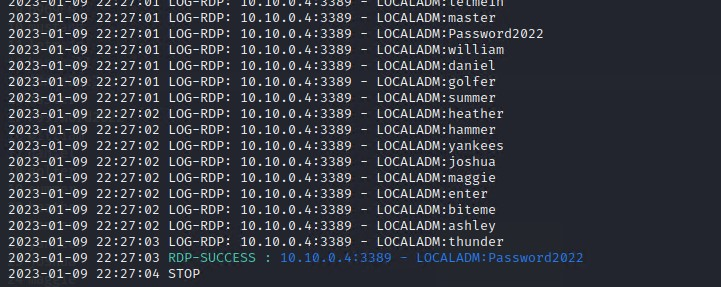
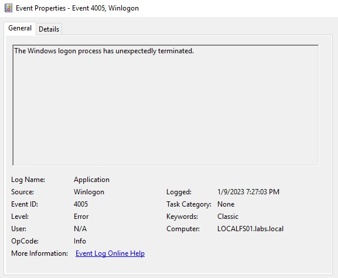
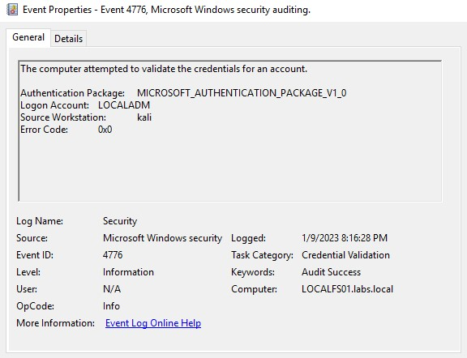
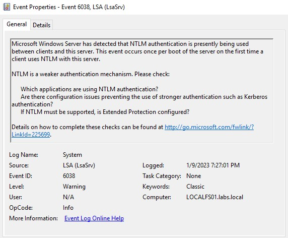
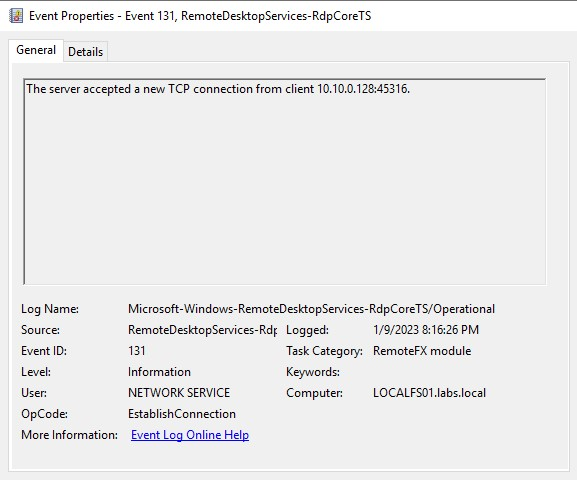
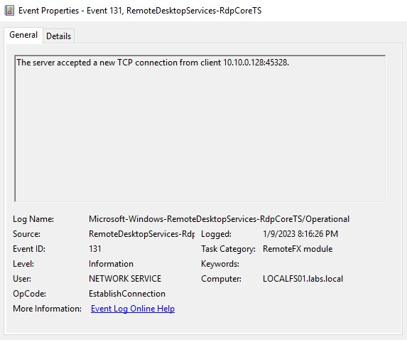
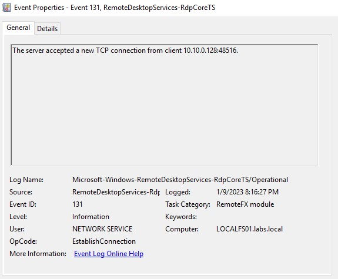
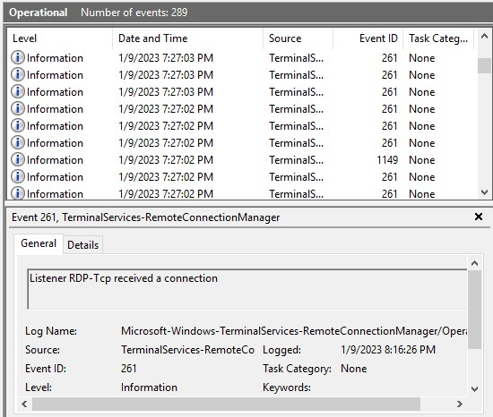
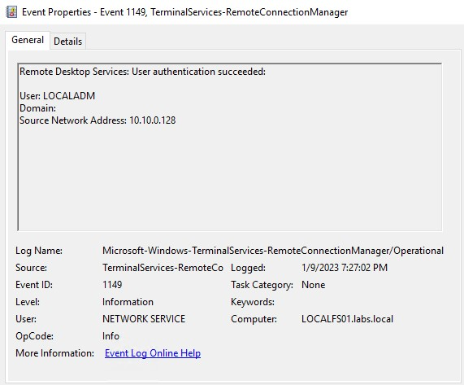

---

#### Exposed on the internet: RDP Incident

##### Case:

A lot of companies still use jump servers that are exposed to the internet. These servers are a good entry point if there is any misconfiguration or vulnerability. But taking into consideration that a zero-day doesn’t appear every day, the misconfiguration is more probable to cause a problem. For instance, in this case, our IT team decide that the local administrator account could connect using RDP to the server.

I’ve changed the name of my local administrator to LOCALADM, but this preventive measure can only help against script kiddies or commodity malware. An experienced attacker can detect the change of name, or maybe use OSINT to guess the renamed account. For this reason, on this excessive, I ignore that change and make the brute force attack.

Some additional consideration is that the local administrator is an account that cannot get locked so the attacker, in theory, has unlimited attempts. On this blog, I want to show how easy it is to make this type of attacks, how can we analyze the logs, use them to detect attackers and how we can prevent this.

##### Bruteforcing RDP with crowbar:

For this exercise, I use crowbar and a custom password list. On a real case, an advance actor may do the same and create its own list in order to make sure he/she can have the best chances to break into the server. For instance, some system administrator user the name of the company, a year, and a symbol at the end. Others may have reused a one of their passwords that end up on a breach.

Let’s start, the following image shows how with a single line and some time, attackers can start brute forcing our applications. As you can see, this brute force attack was fast and didn’t even take a minute. Some attacker may set some time in between of the brute force attempts. On this case, I just sent all the request.

At the end of the execution we have that the password was a weak one Password2022, with this the attacker has gain administrative access to the server. The attacker now can start attempting to enumerate the domain or make some changes to gather credentials.

##### Logs, logs and logs

###### Application Events

I personally didn’t expect to find any indicator for this type of activity but to my surprise there is an event that gets generated when the login using crowbar is successful. The event 4005 is one that can be useful to verify and make sure that this type of tool was used against the server. The problem on alerting on this event is that there are some legitimate cases where this can happen, so it’s not sure that this event means brute force attack.

###### Security Events

You can enable some more auditing, but in this case the only log generated on this category is one of validated credentials. Many companies use a naming standard for its machines, in this case a machine with the name kali not likely to be part of the domain.

###### System Logs

These logs are interesting to me. There are many companies that need to use NTLM because of legacy applications, but many servers don’t need to use this type of authentication. With a good enough baseline, you can make sure to detect any attempt of using NTML in servers that shouldn’t support this.

Until now the events can be helpful, but we don’t really have a real way to confirm that this was indeed a brute force attack. The next logs will give us the context we are missing, these logs are part of Application and Services Logs > Windows.

###### RemoteDesktopServices-RdpCoreTS

On these logs, we can find when a new TCP connection has been initiated, if we start seeing that many connections happen over a small period, we can discover this attack. For instance, I present some logs of the TCP connection started, as you can see on the Logged time this happens on some seconds.

As you can see, the same IP connected to our server many times over some seconds. This is a clear indicator of a brute force attack. On a real environment, you may find that an IP that you can search on VirusTotal and get an idea of said IP.

On the other hand, something that calls my attention is the disconnect reason. I got “the disconnect reason is 14”. I need to understand better what does this mean and if it’s possible to be used.

###### TerminalServices-RemoteConnectionManager

We can find the event 261 that means that a connection has been established, we can notice numerous events in a small period of time.

The event 1149 will give us the user that was authenticated using RDP on this case. This event logs alone can give us the idea of what happened on this server.

###### Detetion ideas

- You can detect when an unexpected computer logs in, for instance by default windows computer have the name Desktop-\<characters\>. This is also a recommended detection if you have a VPN it can help you detect suspicious accesses.
- On the amount of connection generated, we can alert if a number of connection is higher than an expected baseline.
- We can alert on successful logins of users that normally don’t use RDP

###### Prevent

To start, RDP server shouldn’t be exposed to the internet as this can catch the attention of an attacker. The number of attacks that could be prevented if we change this to an VPN is not low. On the other hand, if the RDP server is needed, it’s better to avoid having the local administrator as a remote desktop user. If we have domain users on this type of servers, we can use MFA in order to protect the servers.

Another idea is to block some countries that don’t need access to your network. For instance, some companies make business on many countries except Russia because of the sanctions or laws, well then you can geo-block the country. Something outside the scope of this blog is to install LAPS on all servers. If your RDP server gets compromise and the same local administrator password is used on all servers, the attacker can move laterally without problems.

---

#### Reflexion

+ Exposed RDP services are common, from legacy to modern versions of Windows. I believe this is mainly because cloud service providers (AWS, Azure, OVH, etc.) do not provide secure ways to access these resources over the network; as a result, administrators leave RDP services exposed. Still, this is not entirely the fault of the CSPs, as administrators can use built-in tools like Windows Firewall to at least limit the threat surface.

