---

#### Christmas, malware, and copyright

##### Chain of events:
+ Phishing:
  + Phishing was delivered on the 24th with the pretext of copyright infringement with a link to: https://goo\[.\]su/Iz11g that redirects to 2-cdn2-ovh-bea.energycdn.com
 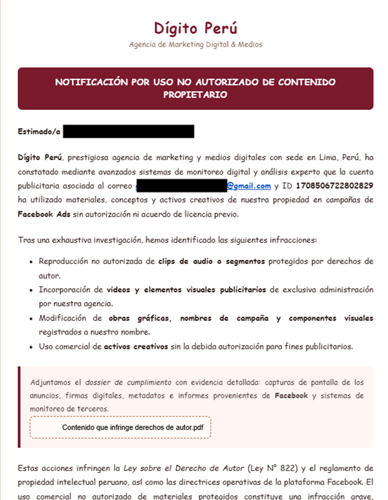
  + The link downloads a zip called: Contenido que infringe derechos de autor 25.zip (Contents that infringe copyright 2025.zip)
+ First payload:
  + The zip contains a legitimate Adobe executable that is used for DLL hijacking with the dll called urlmon.dll
 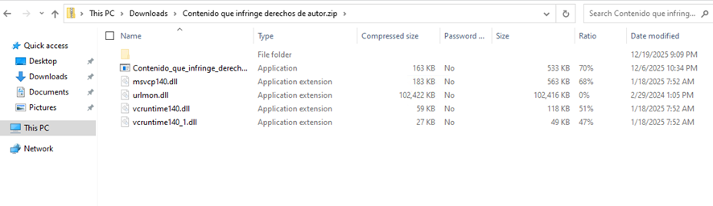
  + When executed, the file will attempt to open a document.pdf in the same folder, showing an error
 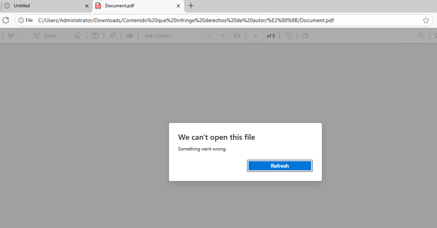
  + Behind there is a command executed to download invoice.pdf, which is a password-protected RAR file and uses a rename Winrar 부가가치세 영수증.jpg extract the contents of invoice.pdf on C:\users\public
 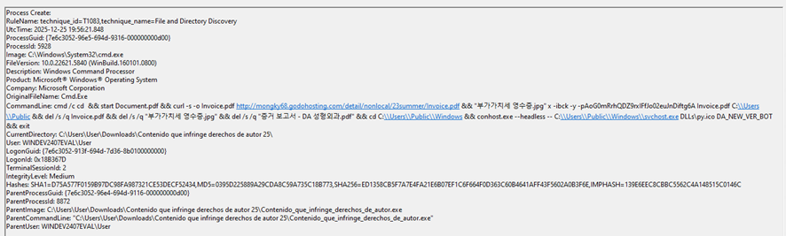
  + The extracted folder is C:\users\public\windows that has svchost.exe a renamed python interpreter that is used to execute the second payload
 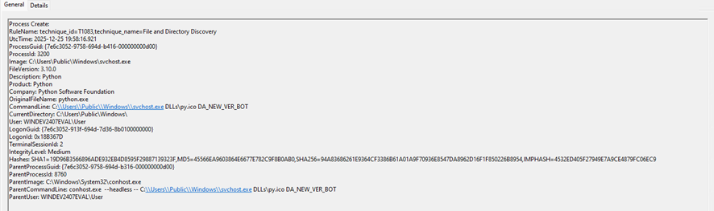
+ Second payload:
  + The second payload is a python script that is obfuscted
 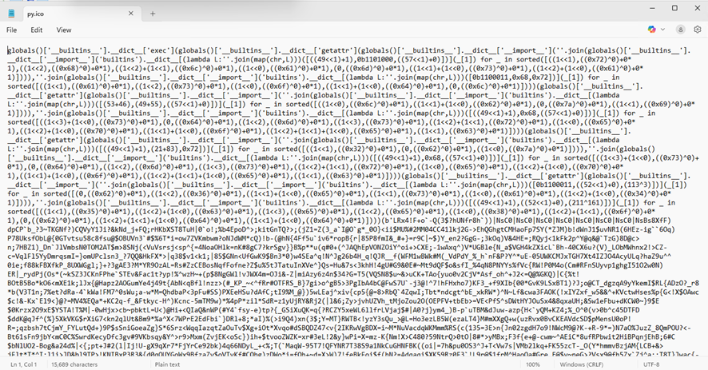
  + The code retrives reports to telegram and uses urlvanish.com to direct to mongky68.godohosting\[.\]com 
 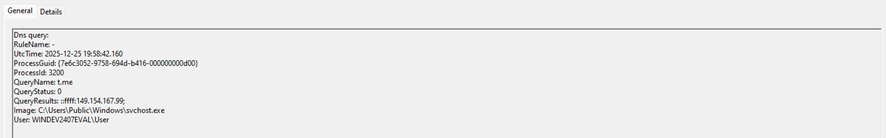
 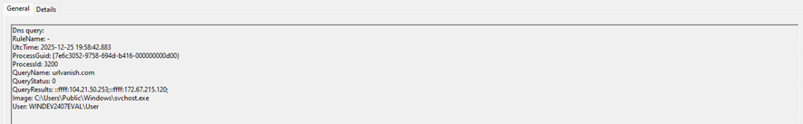
 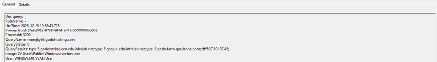
  + Then it download the .dat file that will be used to inject it on msedge
 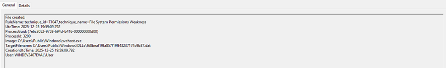
  + Based on this behavior I consider this malware will steal cookies, credentials and others store on the browser
 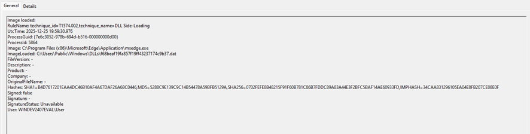
 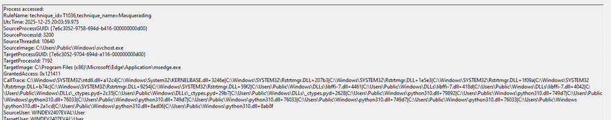
+ Summary
 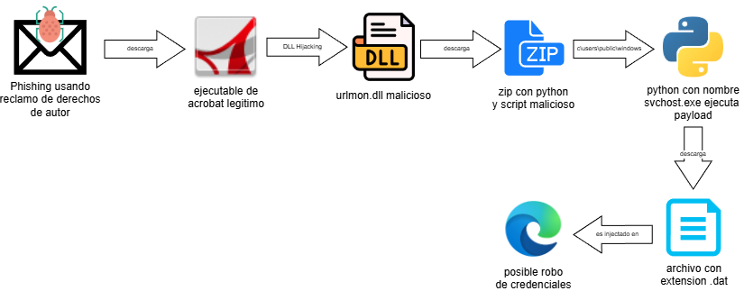

##### Indicators of compromise:
+ mongky68.godohosting\[.\]com
+ goo\[.\]su/Iz11g

---

#### Reflexion
+ This malware, while being able to avoid most AV vendors (according to VirusTotal), is really noisy and could be easily detected based on its behavior with some Sigma rules like proc_creation_win_malware_ryuk. This malware executes a download of a renamed copy of WinRAR and Python, which is suspicious and can be detected by a rule. Also, the execution of svchost (renamed python) from C:\users\public and it's connection to t.me is another possible indicator to detect this type of malware. In summary, this malware behavior is not amazing, but it is effective at its job, avoiding most consumer antivirus programs to steal credentials. 

