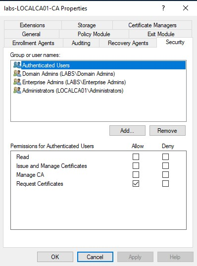
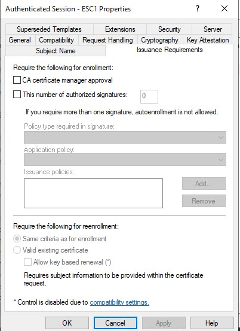
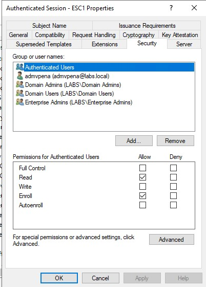
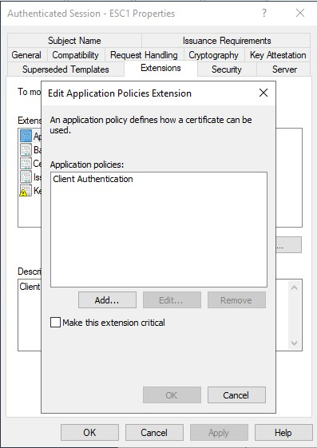
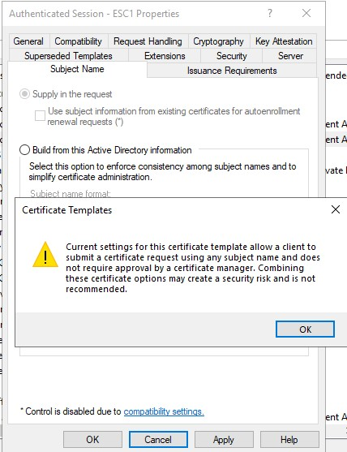

#### ADCS 1

##### Introduction

SpecterOps published a white paper that show the potential attack paths and possible exploitations of certificate templates on ADCS. I've known about this for quite some time but haven’t done a deep dive on this, and taking into consideration the possible impact I'm going to do some experiment.

So what's the impact? Well, in the worst and likely cause, an authenticated user can become a domain admin, and it's possible that defenders won’t even notice. It can be terrible and there are not many ways to detect this type of exploitations, but we can do some things to try to detect this.

But before trying to detect this, I think it's good to understand how this missconfigurations can happen and what good practices can prevent this.

##### Escalation Paths

On their white paper SpectedOps show 8 different escalation paths that they have found, yeah its possible the is some paths have not been discovered yet. I will try to replicate some of them.

##### ESC 1

There are several requirements for this escalation paths. I will go over this one and explain what I think on why would someone use these settings. On this case, the first ones

###### The Enterprise CA grants low-privileged users enrollment rights

Well in this case there is little to blame the administrators as this came by default on my ADCS installation. All authenticated users can request certificates.

So what is happening? Well, we are telling the ADCS that any authenticated user can request a certificate. I see why this is enabled as if this was not the administrators will need to create a new group of users that can request certificates, and as many of the technologies that AD gives, ADCS has to work out of the box. I think that depending on the environment, we can create an AD group that can request certificates. Then after adding this group, we can remove the authenticated users from here.

###### Manager approval is disabled.

I used a copy of the Authenticated Session template, this template came with manager approval disable. Well, on a production environment where an administrator has to do configurations for Intune or other application, he can leave this by default as he may not want to be approving these certificates.

To me this is a difficult decision as in an enterprise environment we may have many certificates being issued. On an ideal world, every certificate that we issue should have a manager approval, but there may be cases where this may be difficult to accomplish. Maybe on a properly configure template we can identify the ones that can have more risk and don’t issue many certificates.

###### No authorized signatures are required 

Similar to the one before, this is a control that you need to enable if you copy the template. Also, maybe time-consuming, so same considerations apply here, but seems like this setting is used for a different type of template.

###### An overly permissive certificate template security descriptor grants certificate enrollment rights to low-privileged users

On this case, the Authenticated Users was by default on the template I used had this enable + write right. As I’m just looking to replicate ESC1 I removed the write right, this will be used on latter escalation paths.

This is a similar case to the first one, we want some users to be able to enrol not everyone, well it depends on the goal of the template.

###### The certificate template defines EKUs that enable authentication.

Well, this is a copy of a template that I edited to make be vulnerable. But I can see how administrators can use this in order to make an easy deployment. This type of EKU and the others are really specific to authenticate, so I don’t really expect this type of template to be open to be requested by anyone. But it’s the next requirement that makes things difficult.

###### The certificate template allows requesters to specify a subjectAltName (SAN) in the CSR

This is the one that puts all together. With this setting enable, the requester can ask for a certificate for the other user. Well now we can see the full picture

We are allowing any user (even attackers) to be able to request certificates. We are not verifying the if the requested certificate is benign or malicious. Furthermore, we can enrol any user we want to the certificate, and we can supply the name of the user that we want to enrol. And we are able to log in using this certificate. All of this combination is what makes any attacker able to request a certificate for a domain admin, enterprise admin, etc and be able to log in as that user.

