#### Do you want free Adobe? Vidar Stealer and Discord

It’s been an active week for Discord phishing. I’ve observed multiple compromised accounts distributing links promising "free" Adobe products: Photoshop, Illustrator, and more. Here is a breakdown of the infection chain and the behavior of the payload.

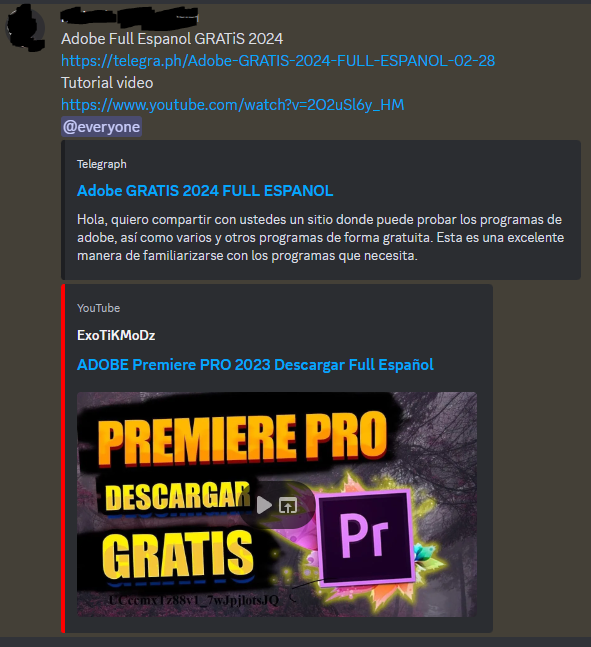

##### The delivery

The threat actor utilizes a multi-stage redirection strategy to deliver the payload. The initial link points to telegra[.]ph. I haven't seen legitimate usage of telegra\[.\]ph, so maybe in a corporate environment, we can block this domain.

https://telegra\[.\]ph/Adobe-GRATIS-2024-FULL-ESPANOL-02-28?sub1=20240303-1119-236b-a488-ce1d13c42405

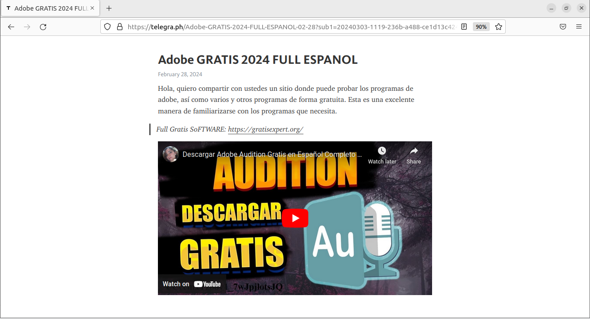

This page has a link to a site that looks like having different programs to download. In reality, all the programs redirect to the same URL on Mediafire.

https://gratisexpert\[.\]org/

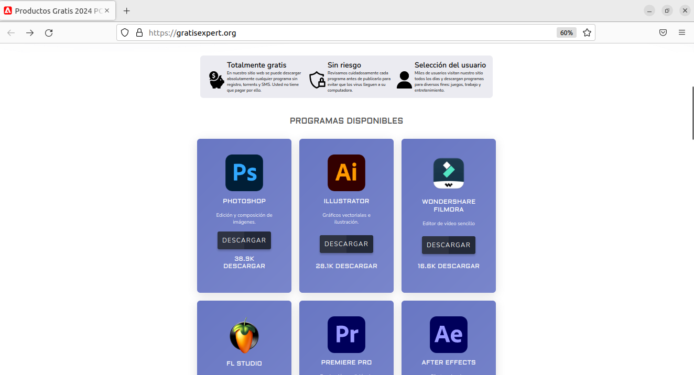

At the time of analysis, there wasn't a single vendor that detected this domain. The domain was bought from Namecheap days before this and hosted behind Cloudflare.

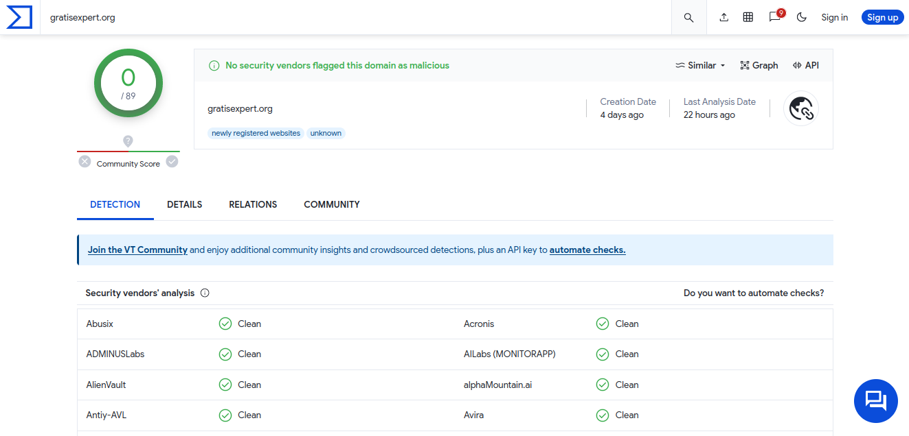

This file is encrypted with a password of 1212. This is made to avoid signature detection, this file was not marked as malicious on Virus Total.

https://www.mediafire\[.\]com/folder/eeuz2dgskwlk1/gratissoft

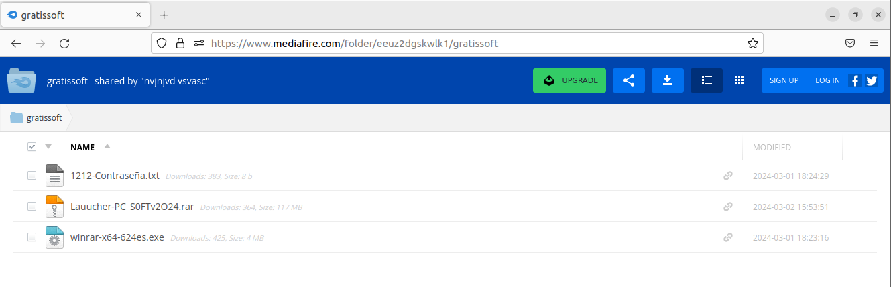

##### Evasion

The file had the name Set-up.exe and was more than 740 MB, so it's not possible to upload it to Virus Total. Also, after extracting the files using the password, Windows Defender doesn't react, so a normal user could think that this is a legitimate installer. 

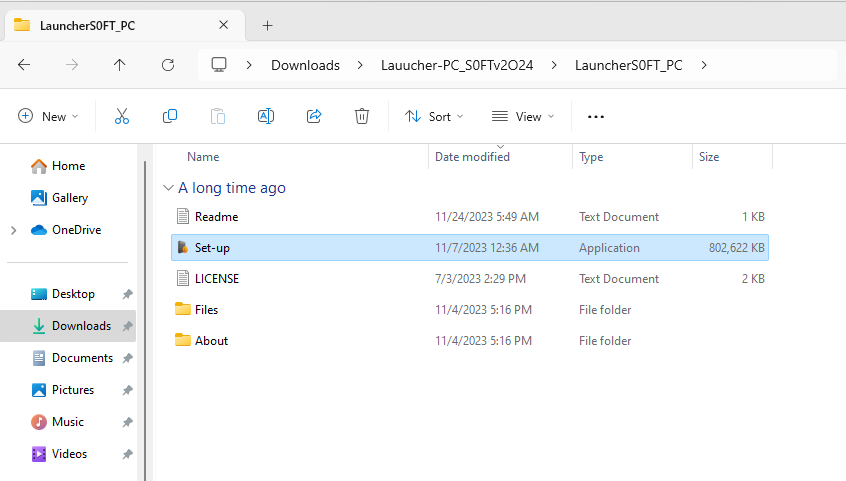

But, when attempting to execute the file, we get a Defender alert classifying it as a stealer and cryware. 

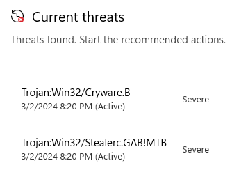

##### Analysing.

After disabling Windows Defender, let's view what this stealer does. Well as expected there are many attempts to open different files and extract information, mainly from different browsers.

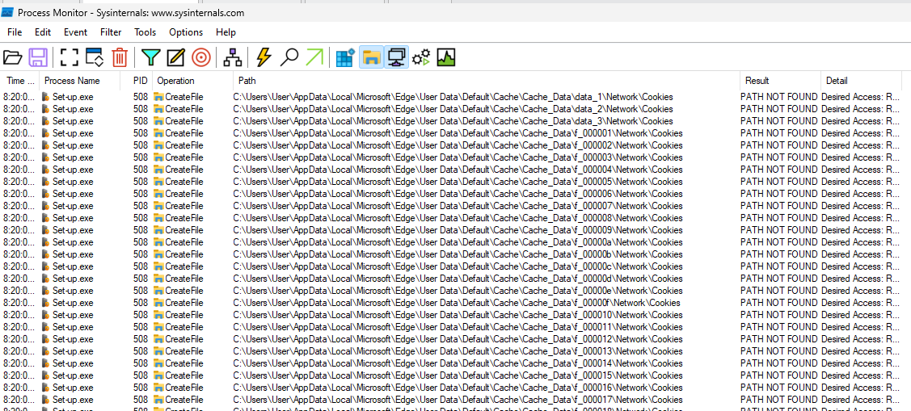

There are other indicators we can search, but I like to find the network indicators, so looking at the network connections done by the executable we can find the C2 5.182.86\[.\]94 using port 80 (HTTP). 

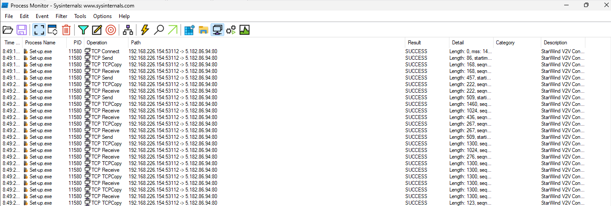

As the traffic is not encrypted, we can capture this using Wireshark and filtering for the traffic to the C2 IP. At first, there is a type of registration to the server. This server won't answer if we attempt to connect to it using a browser, very likely it doesn't allow connections with more headers than the expected ones.

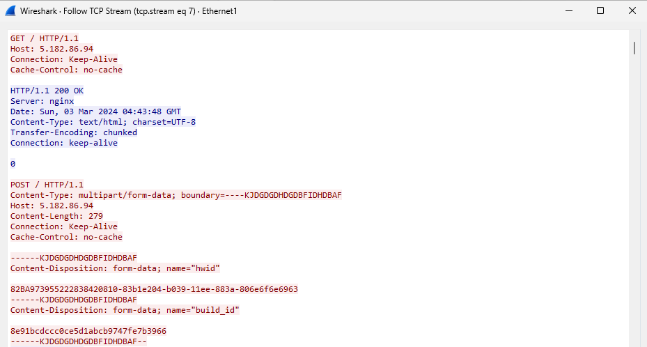

The traffic has an interesting pattern in the body of the request. The first line has the number of characters it will send. The next line is the payload that is going to get processed by the server or agent and the last one is a 0 meaning the end of the request.

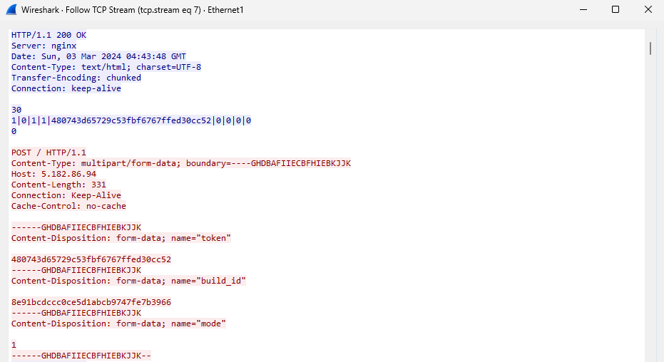

Next, the server sends an encoded string.

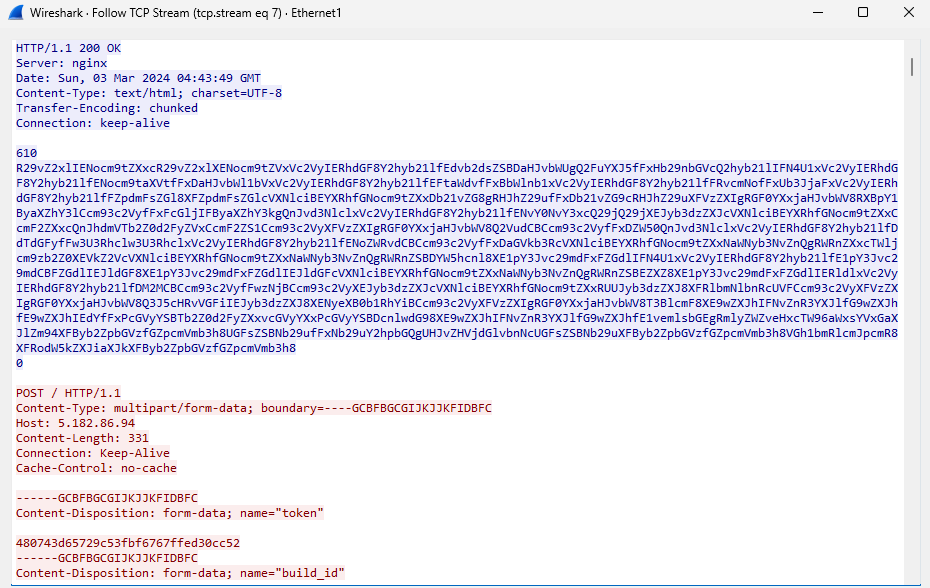

Decoding the string shows that the server is sending a different file it will attempt to steal. We can see the cookies' path for different browsers like Firefox, Chrome, and Opera.

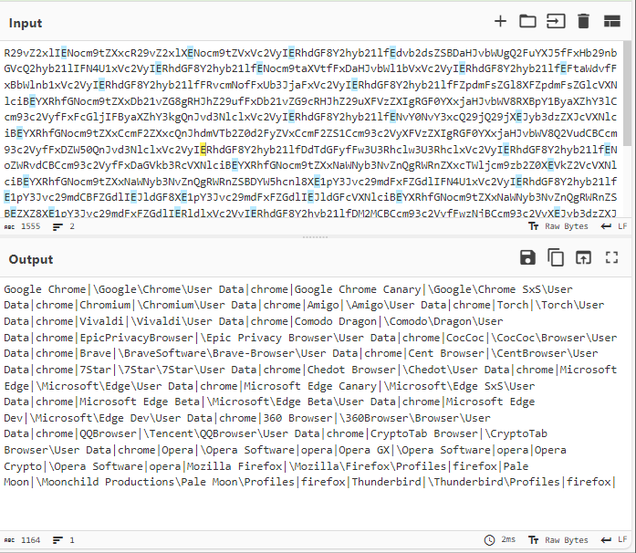

Then, the server sends a new encoded string to the agent.

This new string contains the different IDs of browser extensions. The majority of these are crypto wallets.

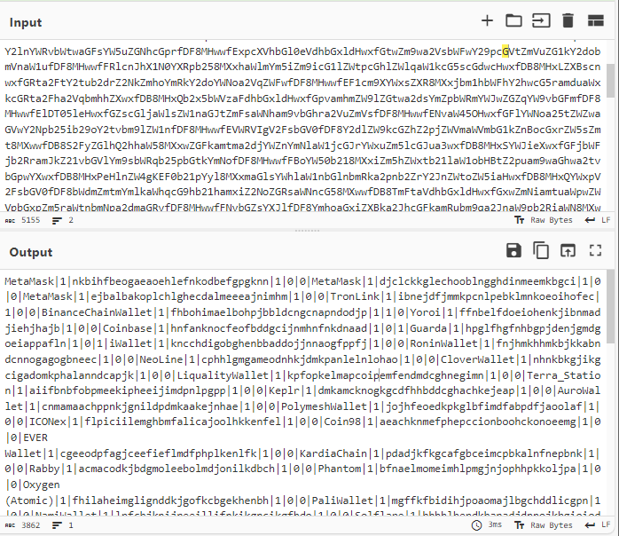

Now it's time for our machine to send encoded data.

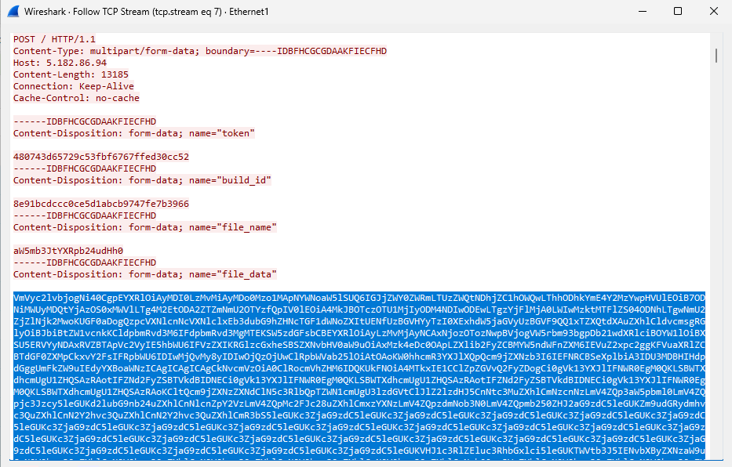

We are sending information about our machine like the file executed, the name of the machine, the number of cores, and others. 

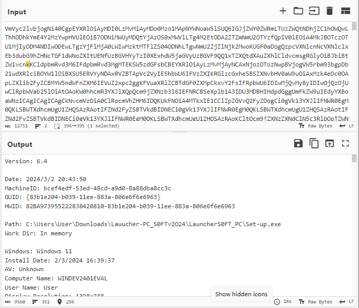

The server sends SQLite3.dll, which is a DLL that allows it to interact with SQLite databases, the same database most browsers use to store cookies.

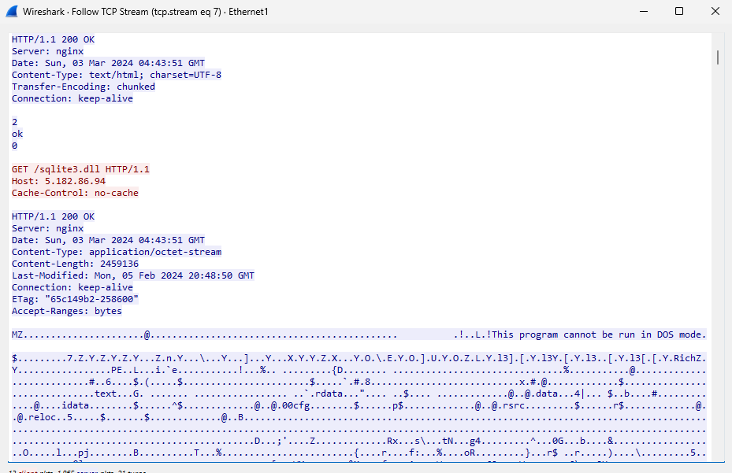

We can see that after this DLL is downloaded, the malware on the machine starts to exfiltrate to cookies of the browser.

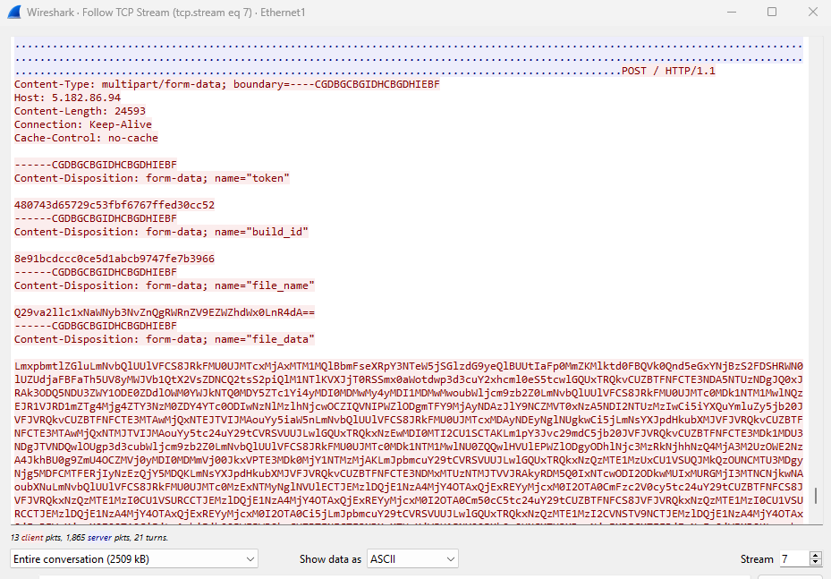

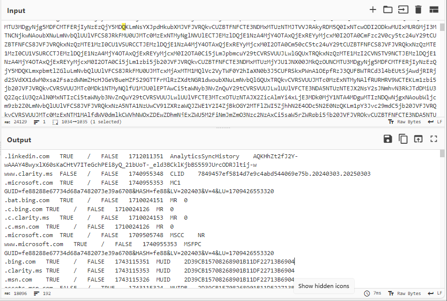

##### Some thoughts

This is a simple stealer and being honest the strategies used to evade defenses are simple but good enough to make many users fall for this. During this past week there I have seen 6 different accounts that got compromised with the same link.

People will fall for this on their machines and this can get passwords, cookies, and wallets compromised. Attackers can use this information or sell this to other groups that can attempt to attack businesses. A defense in depth is necessary.

## IOCs

5.182.86\[.\]94

0521CD6D3CC340ABFE9F340B91987D840BADDF8846D61A5A7D350D1968272B83