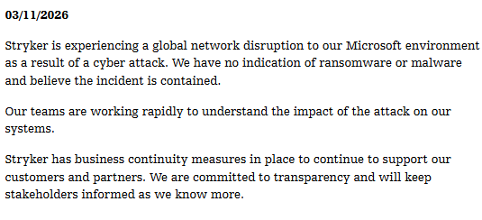

#### What happen?

Microsoft Intune is an enterprise Endpoint Management (MDM) solution provided by Microsoft as a SaaS. While it is a powerful tool capable of managing thousands of devices, its centralized power makes it a high-value target. On March 11, 2026, a cyberattack against Stryker Corporation by the Handala Hack Group exploited Intune to remotely wipe thousands of corporate machines.

Stryker concluded their incident response process on March 23, 2026. This resulted in over 10 days of significant business disruption, a downtime that likely cost the organization millions of dollars.
#### What we learn?

Intune must be hardened to prevent the tool itself from being turned against the organization. Since the attack, major security entities have released hardening guides:

- CISA: https://www.cisa.gov/news-events/alerts/2026/03/18/cisa-urges-endpoint-management-system-hardening-after-cyberattack-against-us-organization
- PALO ALTO: https://unit42.paloaltonetworks.com/handala-hack-wiper-attacks/

Both provide essential recomendations like:
- Enforce least privilege
    - Implement just-in-tim access like Microsoft Entra Privilege Identity Management
    - Limit the number of administrator
    - Use cloud native account for administrators
- Reduce the session lifetime in administrative portals
- Enforce phishing-resistant MFA
- Configure multi admin approval in Intune

#### What we are forgetting?

The use of Intune as an attack vector should not come as a surprise. Adversaries have mastered the art of "living off the land," using our own administrative tools to achieve their objectives. For years, ransomware actors have used Active Directory (AD) features to deploy malware or disable defenses. More recently, attackers have even used internal communication platforms to spy on incident response teams during an active breach.

The Stryker case demonstrates a shift in the threat landscape. Attackers now recognize that while AD is a primary target, MDM platforms offer a direct, high-privilege highway to every endpoint in the company.

I anticipate that adversaries will increasingly target device management platforms (MDM, EDR, and RMM tools) just as they have historically targeted AD. Organizations must move beyond securing just their identities and start treating their management consoles as Tier-0 assets. It is time to inventory every tool capable of managing devices and apply rigorous hardening standards immediately.