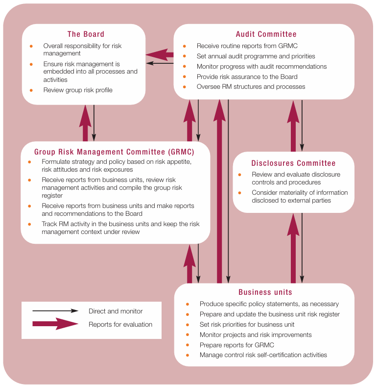

---

#### Risk Management Process
+ Helpful to discover, assess, and prioritize weaknesses and to determine cost-effective countermeasures.
+ We need to understand the adversaries or threats to the system and the vulnerabilities of said system
+ There are different frameworks, some use threes, others checklists, and others are more abstract
+ This should be a continuous process that supports the development and implementation of the strategy in the organization
+ Must be integrated into the cultural organization

##### User participation
+ Board mandate and commitment: critical to ensure risk initiative is successful
+ The following image shows how user participation improves the risk management process

---

#### Collaborative Discussion

##### Peer Response

Hi Amnon,

I agree with the idea of engaging with local communities from the outset to develop tools and processes that are well-suited to them. Still, some risks need to be taken into consideration, primarily those related to privacy and freedom. There is a need to ensure that local communities understand the type of data being collected or used to develop new solutions, to avoid any adverse impacts on their lives. New technologies can require enormous amounts of data to predict or detect behavior using AI accurately. If local communities are unaware of this, the solution could ultimately lead to issues with their customs and rights (SUN et al., 2020). A study on developing inclusive practices for older people highlights concerns about gathering data from this vulnerable group while maintaining their privacy (Tupasela et al., 2023). In summary, while I agree that local communities are essential for developing better products, there is a lack of consideration for how to enable them to participate in this process while preserving their privacy.

 

SUN, N. et al. (2020) Human Rights and Digital Health Technologies. Health and human rights. 22 (2), 21–32.

Tupasela, A. et al. (2023) Older people and the smart city: Developing inclusive practices to protect and serve a vulnerable population. Internet policy review. [Online] 12 (1), 1–21.

#### Reflexion
+ The risk process, as with many other processes, cannot really work without board and user commitment. I have seen some processes where the board is not committed to improving security. This causes other directors and managers to avoid working on these processes, as they are seen as unnecessary. On the other hand, when board commitment is evident, managers and directors pay close attention to these issues and involve their business units in the process, which significantly improves adoption.

---

#### Reading 

+ Ferma (2011)  A structured approach to Enterprise Risk Management (ERM) and the requirements of ISO 31000, The Federation of European Risk Management Associations (FERMA). Available at: https://www.ferma.eu/wp-content/uploads/2011/10/a-structured-approach-to-erm.pdf (Accessed: 21 November 2025). 
+ Popov, G. et al. (2022) Risk assessment : a practical guide to assessing operational risks. Second edition. Hoboken, New Jersey: Wiley.
+ Renn, O. et al. (2021) The opportunities and risks of digitalisation for sustainable development: a systemic perspective. GAIA - Ecological Perspectives for Science and Society. [Online] 30 (1), 23–28.
+ Salter, C. et al. (1998) ‘Toward a secure system engineering methodolgy’, in Proceedings of the 1998 Workshop on New Security Paradigms. New York, NY, USA: Association for Computing Machinery (NSPW ’98), pp. 2–10. Available at: https://doi.org/10.1145/310889.310900.